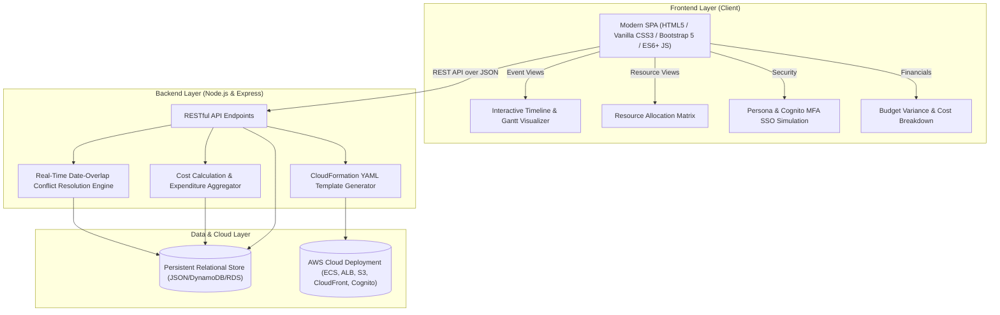

# APEX — Event Resource Allocation Management System

An enterprise-grade, unified web application designed to solve the complexity of managing multi-event resources simultaneously: staff assignments, equipment allocation, venue coordination, vendor contracts, financial budgeting, and interactive event schedules with automated real-time conflict detection and AWS Cloud readiness.

---

## 📋 Problem Statement & Objective

Event management agencies and organizers frequently operate multiple concurrent events across diverse venues. In traditional workflows, resource tracking is fragmented across disparate spreadsheets, leading to:
- **Staff Double-Booking:** Key personnel (event coordinators, A/V technicians, security leads) scheduled across overlapping events.
- **Equipment Shortages & Over-Allocation:** High-demand audio/video/staging gear assigned beyond available warehouse stock during peak event dates.
- **Venue Collisions:** Overlapping bookings for shared conference rooms, auditoriums, and ballrooms.
- **Vendor Miscommunication:** Untracked catering, security, decor, and AV contracts without centralized deliverables.
- **Budget Overruns:** Lack of real-time variance monitoring between allocated budgets and actual aggregated resource expenses.

**APEX** addresses these challenges through a centralized control matrix powered by an automated collision-detection engine, interactive timeline Gantt schedules, role-based personas, and CloudFormation infrastructure generation.

---

## 🏛️ System Architecture



---

## 💻 Technology Stack

| Layer | Technologies & Tools | Key Responsibilities |
| :--- | :--- | :--- |
| **Frontend** | **React.js 18**, JSX Components, Hooks (`useState`, `useEffect`, `useMemo`, `useCallback`), Modern Glassmorphic CSS3, Bootstrap 5 Grid | Reactive Single Page Application (SPA), declarative component trees, instantaneous state updates, responsive Kanban drag/shift, real-time clash alerts, and dynamic chart updates. |
| **Backend** | Node.js, Express.js REST Framework | High-throughput modular REST API, date-overlap range calculation algorithms, cascading relational deletions, and CloudFormation template compilation. |
| **Database** | Persistent Relational Store (`data/` JSON models) with DynamoDB/RDS schemas | Seeded data collections for `events`, `staff`, `equipment`, `venues`, `vendors`, `assignments`, `allocations`, and `coordinations`. |
| **AWS Cloud** | CloudFormation, Amazon S3, CloudFront, ECS Fargate, ALB, RDS Multi-AZ, Amazon Cognito, CloudWatch | Enterprise-ready Infrastructure-as-Code (IaC) generator for multi-region high availability, automated container scaling, and secure IAM/Cognito auth. |

---

## ✨ Key Features & Capabilities

### 1. 📅 Multi-Event Lifecycle Management
- Manage multiple simultaneous events (`Tech Summit 2026`, `Annual Charity Gala`, `Summer Music Festival`, etc.).
- Complete CRUD management with dates, venues, descriptions, budget caps, and status tracking (`Draft`, `Confirmed`, `In Progress`, `Completed`, `Cancelled`).

### 2. ⚡ Real-Time Collision & Conflict Engine
- **Staff Double-Booking Detection:** Evaluates event date ranges to flag anytime an employee is assigned to more than one active event within an overlapping date window.
- **Peak Equipment Over-Allocation:** Daily interval scanner calculates aggregate gear allocations against total warehouse inventory and flags exact date ranges where shortage occurs.
- **Visual Warning Badges:** Live notifications and clash cards detailing involved events, overlapping dates, and required vs. available inventory quantities.

### 3. 👥 Staff Resource Allocations
- Detailed staff directory with roles, daily billing rates, and contact credentials.
- Assign coordinators, engineers, stage managers, and security leads with role specialization and automated cost aggregation.

### 4. 📦 Equipment Inventory & Utilization
- Catalog across Audio, Lighting, Video, Staging, and Furniture.
- Tracks warehouse stock, peak allocated units, and utilization percentages with rental rate calculations.

### 5. 🏛️ Venue & Facility Directory
- Manage physical venues, capacity caps, standard rental pricing, and available amenities.

### 6. 🤝 Vendor Coordination & Contracts
- Track external supplier relationships (Catering, Security, Audio/Visual, Decor).
- Monitor contract amounts, deliverables, and payment milestones (`Paid`, `Pending`, `Unpaid`).

### 7. 📊 Financial Analytics & Budget Tracking
- Live calculation of total actual expenses (Staff cost = `dailyRate * durationDays`, Equipment cost = `rentalRate * qty * durationDays`, Vendor fees).
- Budget vs. Actual variance tracking with progress indicators and category breakdowns.

### 8. ☁️ AWS Cloud Center & IaC Provisioning
- Built-in CloudFormation Infrastructure generator supporting configurable environments (`Development`, `Staging`, `Production`), multi-region targets, database instance sizing, and Cognito SSO.
- One-click template download (`cloudformation-infrastructure.yaml`) ready for `aws cloudformation deploy`.

---

## 🚀 Quick Start Guide

### Prerequisites
- [Node.js](https://nodejs.org/) (version 18.x or later recommended)
- `npm` (Node Package Manager)

### Installation & Run

1. Clone or open the repository folder:
   ```bash
   cd "c:/Users/Saran R/projects/stack queue"
   ```

2. Install dependencies (Express):
   ```bash
   npm install
   ```

3. Launch the server:
   ```bash
   npm start
   ```

4. Open your browser and navigate to:
   ```
   http://localhost:3000
   ```

---

## 🧪 Automated Testing

Execute the comprehensive API integration test suite:
```bash
npm test
```
The test suite verifies:
- ✅ Event CRUD endpoints & seed populations
- ✅ Real-time conflict engine outputs
- ✅ Venue & Vendor creation, update, and cascading deletion
- ✅ Equipment allocation & stock calculations
- ✅ AWS CloudFormation template generator

---

## 👤 Test Personas (One-Click Sign-In)

The login screen features pre-configured persona buttons to quickly test the application under different roles:

| Persona | Name | Email | Role |
| :--- | :--- | :--- | :--- |
| **Director** | Sarah Miller | `sarah.manager@apexevents.com` | Event Operations Director |
| **Coordinator** | James Vance | `james.coord@apexevents.com` | Senior Event Coordinator |
| **Logistics** | Maria Garcia | `maria.tech@apexevents.com` | Equipment & Logistics Lead |
| **Finance** | David Kim | `david.finance@apexevents.com` | Financial Comptroller |
| **Vendor Mgr** | Lisa Patel | `lisa.vendor@apexevents.com` | Vendor Relations Manager |

---

## 📡 REST API Reference

| Method | Endpoint | Description |
| :--- | :--- | :--- |
| `GET` | `/api/conflicts` | Returns all detected staff double-bookings & equipment shortages |
| `GET` | `/api/events` | Retrieves all events with calculated duration, costs, & conflict flags |
| `POST` | `/api/events` | Creates a new event record |
| `PUT` | `/api/events/:id` | Updates event details |
| `DELETE` | `/api/events/:id` | Deletes an event and cascades unallocations |
| `GET` | `/api/staff` | Retrieves all staff personnel |
| `POST` | `/api/staff` | Registers a new staff member |
| `GET` | `/api/equipment` | Retrieves inventory with peak allocation & utilization percentage |
| `POST` | `/api/equipment` | Adds new equipment to inventory |
| `GET` | `/api/venues` | Retrieves venue directory and capacity |
| `POST` | `/api/venues` | Adds a new venue |
| `GET` | `/api/vendors` | Retrieves all vendor contacts |
| `POST` | `/api/vendors` | Registers a new vendor |
| `GET` | `/api/assignments` | Retrieves all staff assignments linked with events |
| `POST` | `/api/assignments` | Assigns a staff member to an event |
| `GET` | `/api/allocations` | Retrieves equipment allocation records |
| `POST` | `/api/allocations` | Allocates equipment quantity to an event |
| `GET` | `/api/coordinations` | Retrieves vendor contract records |
| `POST` | `/api/coordinations` | Adds a vendor engagement to an event |
| `POST` | `/api/aws/template` | Generates a downloadable CloudFormation YAML template |
